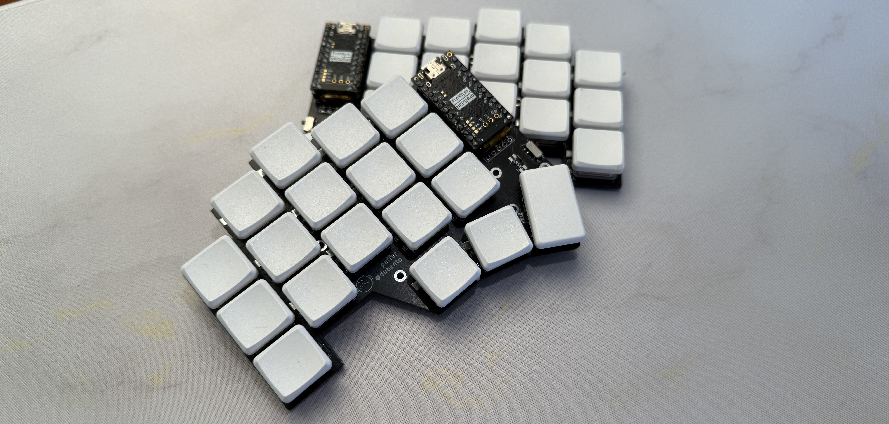

# Puffer

Wireless Ergo Split Mechanical Keyboard.
Based on the [temper keyboard](https://github.com/raeedcho/temper), the Puffer has been upgraded for more comfortable use by those with larger hands.

Only supports Kailh Choc for now.

## Updates

- Increase spacing between keys, from choc spacing (18x17mm) to 19x18mm
- Optional direct soldering of switches or hotswap pads
- Added tenting puck support
- Support for SMD Diodes only

## Features

- 36-key split keyboard 3 rows x 5 columns + 3 thumb keys per half
- Wireless
- Reversible PCB
- Custom spacing 19x18mm
- Nice!Nano (and similar) compatible

## ZMK

[ZMK firmware and personal keymap.](https://github.com/DuBento/zmk-config-puffer)

## Notes

Due to change in overall dimensions this board is not compatible with temper/chocofi cases.

For trying out the dimensions print this [file](print.pdf). 

## Build Guide

Take a look at [Guide](./guide/BUILD.md).

## TODO

- Make case and bottom plate