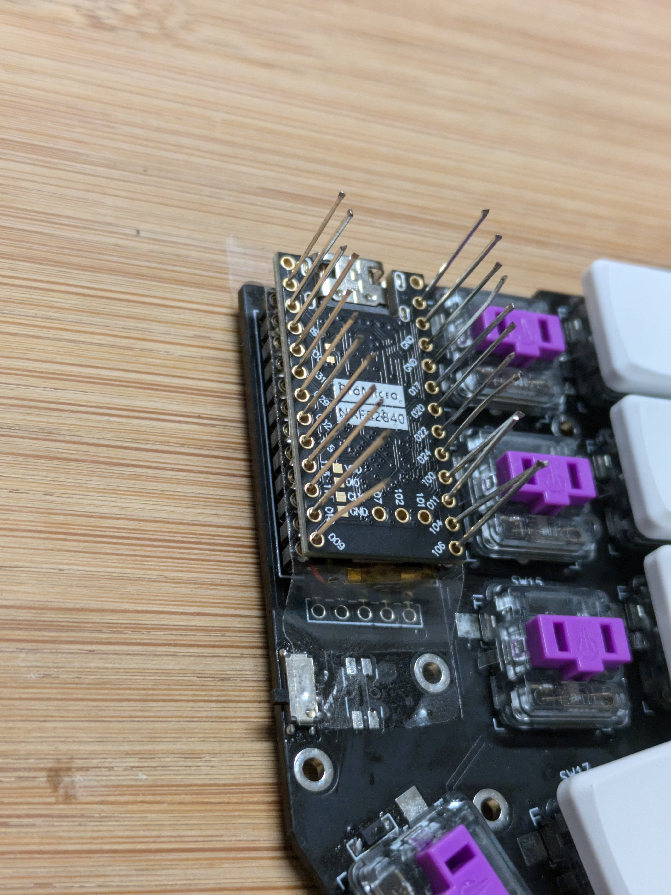

## Materials

- 2x PCB (gerber files in [releases](https://github.com/DuBento/puffer/releases))
- 2x nice!nanos (or [alternatives](https://github.com/joric/nrfmicro/wiki/Alternatives))
- 2x LiPo batteries 301230 to fit under the microcontroller 
- 2x SPDT SMD toggle switches (for ON/OFF)
- 36x Kailh choc v1 switches
- (Optional) 36x Kailh choc hotswap sockets
- 36x Choc v1 keycaps
- 36x 1N4148 SOD-123 SMD diodes
- Female MCU socket

## Photo log

